<div align="center">


<h1>BentaBoard</h1>

**BentaBoard: From Bawat Benta to Tunay na Kita**

*A full-stack business management web app built for small-scale Filipino sellers — sari-sari stores, market vendors, and online resellers.*

---

[](https://final-project-penihamino-bsit2a-1.onrender.com) &nbsp; [](https://github.com/your-username/bentaboard)

       

</div>

---

## 📌 What is BentaBoard?

BentaBoard is a web-based Small Seller Business Management System designed to help micro-entrepreneurs in the Philippines, such as sari-sari store owners, market vendors, online sellers, and small food business operators, manage their daily business activities more efficiently. Instead of relying on handwritten records or memory which often lead to errors, missed entries, and difficulty in tracking finances. The system provides a centralized platform where users can record products, monitor sales, track expenses, and log inventory purchases and many more.

---

## ✨ Features

### 👤 Seller Portal

| Feature | Details |
|---|---|
| Authentication | Email registration with verification link via Nodemailer |
| Dashboard | Summary cards: Total Sales, Expenses, Items Sold, Net Profit |
| Inventory | Full CRUD for products with stock tracking |
| Sales Log | Auto-computed totals per transaction |
| Expenses | Track by category and description |
| Purchases | Supplier restocking records |
| Analytics | Bar chart with daily / weekly / monthly / yearly filters |
| Reports | Date-range filter with printable PDF export |
| Weather | Real-time data powered by OpenWeatherMap API |
| Dark Mode | Toggleable light/dark theme |
| Responsive | Optimized for mobile, tablet, and desktop |

### 🔐 Admin Portal

| Feature | Details |
|---|---|
| Admin Dashboard | Platform-wide stats: total users, sellers, admins, and revenue |
| User Management | View all registered users with search functionality |
| Seller Reports | View individual seller activity and transaction records |
| System Settings | Platform information and appearance controls |

### ⚙️ CRUD Support

| Module | Create | Read | Update | Delete |
|---|:---:|:---:|:---:|:---:|
| Products | ✅ | ✅ | ✅ | ✅ |
| Sales | ✅ | ✅ | ⛔ *(locked for data accuracy)* | ✅ |
| Expenses | ✅ | ✅ | ✅ | ✅ |
| Purchases | ✅ | ✅ | ✅ | ✅ |

---

## 🛠️ Technology Stack

| Category | Technology | Purpose |
|---|---|---|
| **Frontend** | HTML5, CSS3, Bootstrap 5 | UI structure and responsive layout |
| **Backend** | Node.js, Express.js | REST API and server logic |
| **Database** | MongoDB (MongoDB Atlas) | Cloud-hosted NoSQL data storage |
| **Auth** | JWT + Nodemailer | Secure login and email verification |
| **External API** | OpenWeatherMap API | Real-time weather data |
| **Deployment** | Render | Free cloud hosting |

---
## Screenshots

<h3 align="center">Admin-dashboard</h3>
<p align="center">
  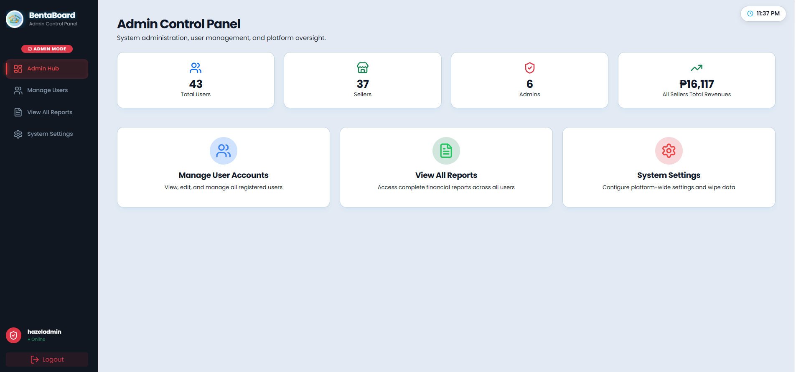
</p>

<h3 align="center">Admin-login</h3>
<p align="center">
  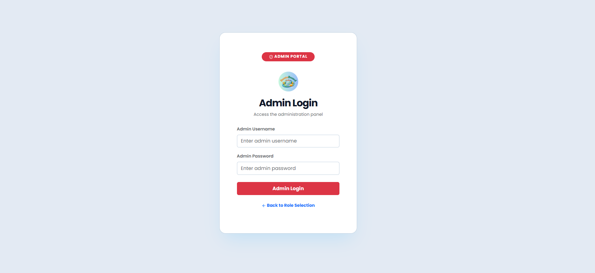
</p>

<h3 align="center">Admin-manage users</h3>
<p align="center">
  
</p>

<h3 align="center">Admin-seller reports</h3>
<p align="center">
  
</p>

<h3 align="center">Admin-settings</h3>
<p align="center">
  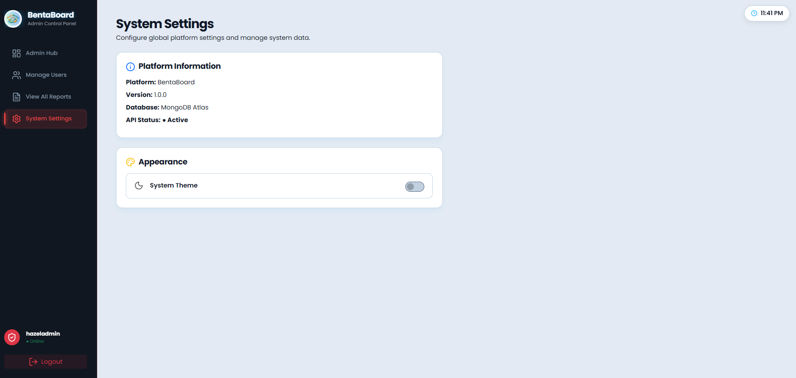
</p>

<h3 align="center">Analytics</h3>
<p align="center">
  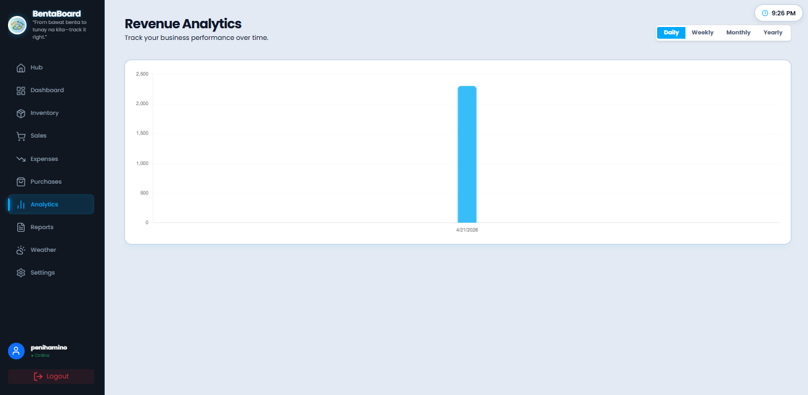
</p>

<h3 align="center">Dashboard</h3>
<p align="center">
  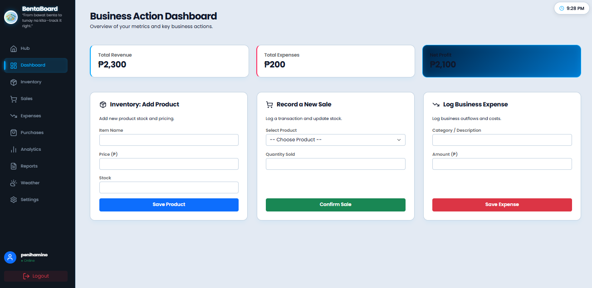
</p>

<h3 align="center">Expenses</h3>
<p align="center">
  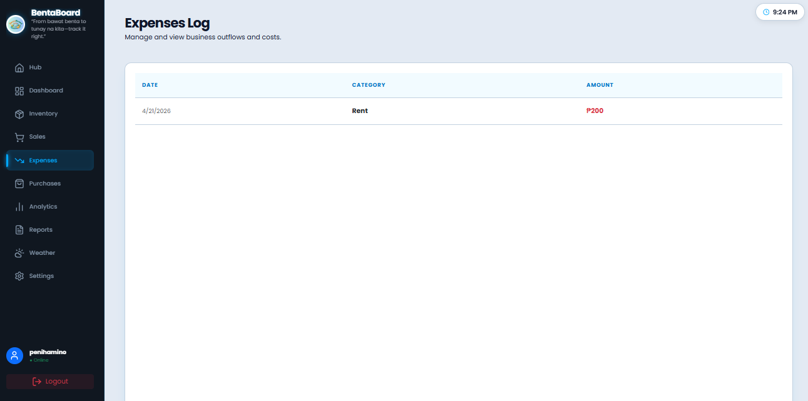
</p>

<h3 align="center">Inventory</h3>
<p align="center">
  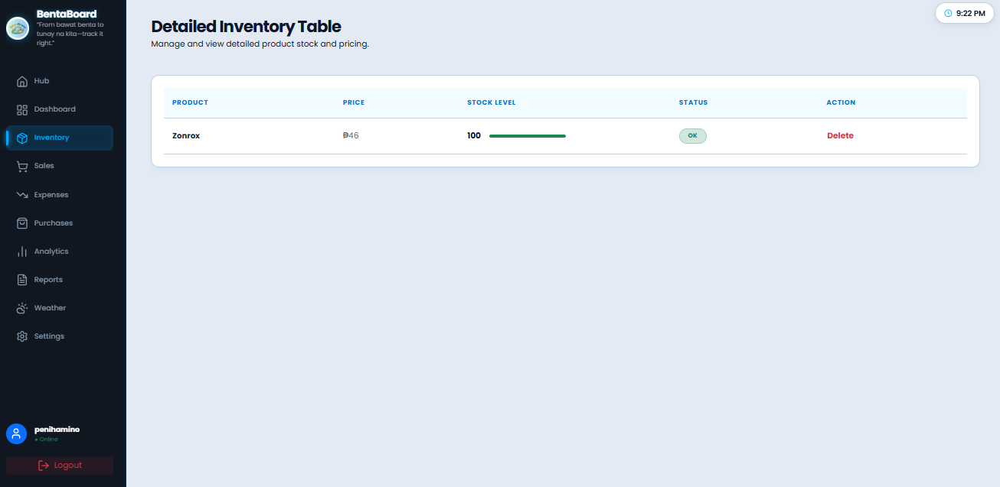
</p>

<h3 align="center">Landing Page</h3>
<p align="center">
  
</p>

<h3 align="center">Login</h3>
<p align="center">
  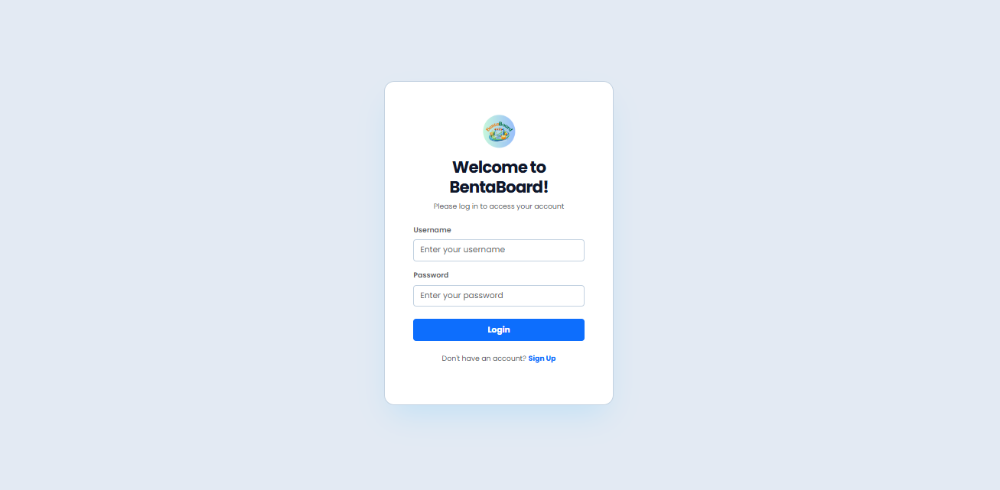
</p>

<h3 align="center">Purchases</h3>
<p align="center">
  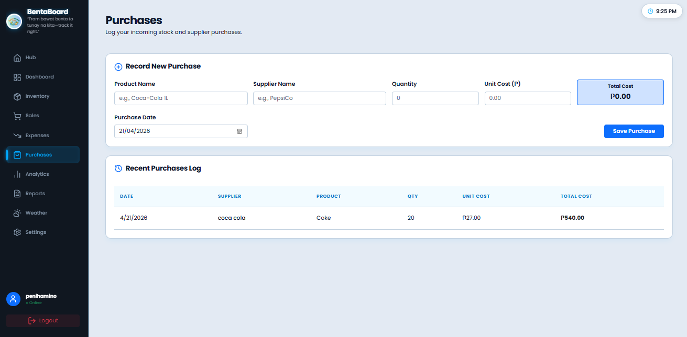
</p>

<h3 align="center">Register</h3>
<p align="center">
  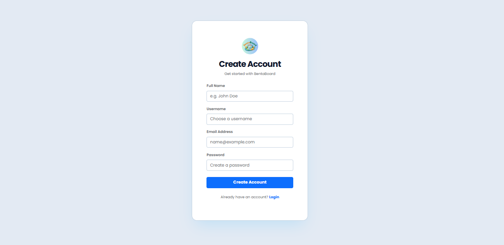
</p>

<h3 align="center">Reports</h3>
<p align="center">
  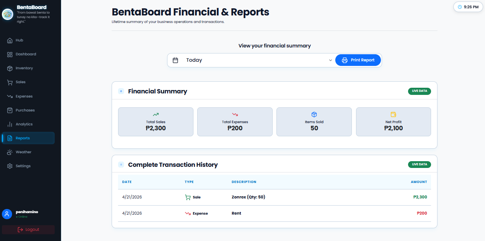
</p>

<h3 align="center">Role-select</h3>
<p align="center">
  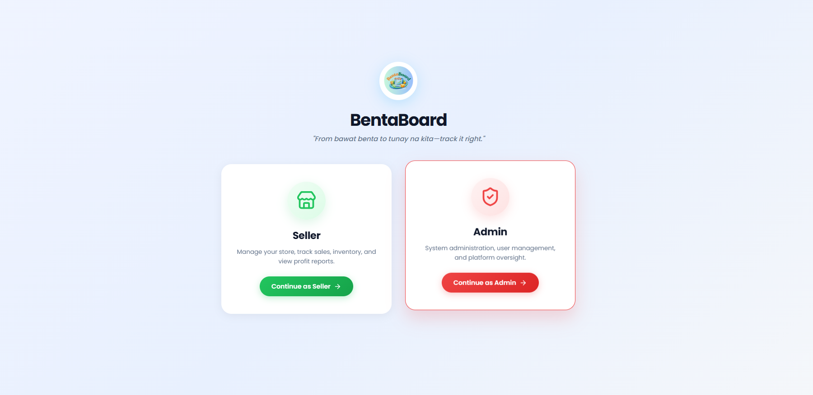
</p>

<h3 align="center">Sale</h3>
<p align="center">
  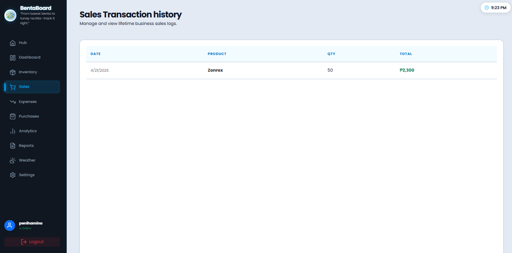
</p>

<h3 align="center">Settings</h3>
<p align="center">
  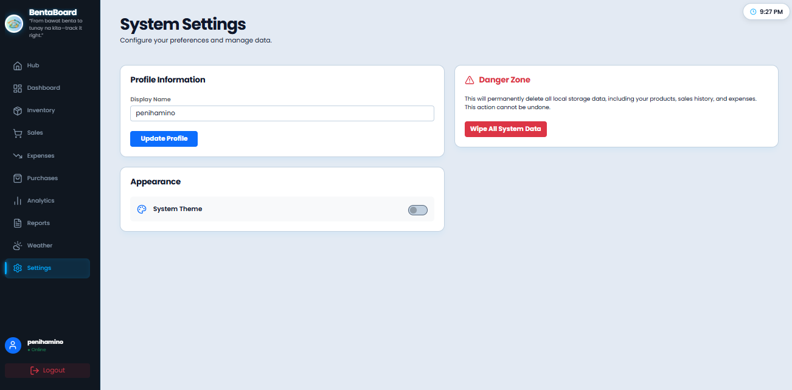
</p>

<h3 align="center">Weather</h3>
<p align="center">
  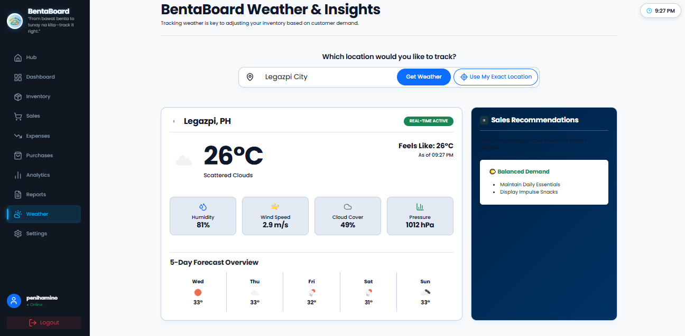
</p>

## 🖼️ System Design

### Architecture Diagram
<p align="center">
  
</p>

### Entity Relationship Diagram (ERD)
<p align="center">
  
</p>

### Use Case Diagram
<p align="center">
  
</p>

---

## 📂 Detailed Folder Structure

```text
final-project-PeNiHAMiNo-BSIT2A/
|-- backend/
|   |-- config/
|   |   `-- db.js
|   |-- controllers/
|   |   |-- authController.js
|   |   |-- dataController.js
|   |   |-- expenseController.js
|   |   |-- productController.js
|   |   |-- purchaseController.js
|   |   |-- saleController.js
|   |   |-- userController.js
|   |   `-- verificationController.js
|   |-- middleware/
|   |   `-- authMiddleware.js
|   |-- models/
|   |   |-- Admin.js
|   |   |-- Expense.js
|   |   |-- Product.js
|   |   |-- Purchase.js
|   |   |-- Sale.js
|   |   |-- User.js
|   |   `-- VerificationCode.js
|   |-- routes/
|   |   |-- auth.js
|   |   |-- dataRoutes.js
|   |   |-- expenseRoutes.js
|   |   |-- productRoutes.js
|   |   |-- purchaseRoutes.js
|   |   |-- saleRoutes.js
|   |   |-- userRoutes.js
|   |   `-- verificationRoutes.js
|   |-- package.json
|   `-- server.js
|-- database/
|-- docs/
|   |-- lab11/
|   |   `-- Screenshot PNG files
|   |-- planning/
|   |   |-- BentaBoard-Final Project Proposal.pdf
|   |   |-- ERD - BentaBoard.png
|   |   |-- System Architecture Diagram - BentaBoard.png
|   |   `-- UML - BentaBoard.png
|   `-- Phase lab report PDF files
|-- frontend/
|   |-- css/
|   |   `-- style.css
|   |-- fonts/
|   |   `-- Poppins font files
|   |-- img/
|   |   |-- bentaboard.png
|   |   `-- icons/
|   |       `-- PWA icon files
|   |-- js/
|   |   |-- admin-script.js
|   |   |-- analytics.js
|   |   |-- auth.js
|   |   |-- dashboard.js
|   |   |-- expenses.js
|   |   |-- hub.js
|   |   |-- inventory.js
|   |   |-- main.js
|   |   |-- notifications.js
|   |   |-- purchases.js
|   |   |-- pwa-install.js
|   |   |-- pwa-register.js
|   |   |-- reports.js
|   |   |-- role-select.js
|   |   |-- sales.js
|   |   |-- saleslogs.js
|   |   |-- settings.js
|   |   |-- shared.js
|   |   `-- weatherAPI.js
|   |-- admin-dashboard.html
|   |-- admin-login.html
|   |-- admin-reports.html
|   |-- admin-settings.html
|   |-- admin-users.html
|   |-- analytics.html
|   |-- dashboard.html
|   |-- expenses.html
|   |-- index.html
|   |-- inventory.html
|   |-- login.html
|   |-- manifest.json
|   |-- purchases.html
|   |-- register.html
|   |-- reports.html
|   |-- role-select.html
|   |-- saleslogs.html
|   |-- settings.html
|   |-- sw.js
|   `-- weather.html
`-- README.md
```

---

## 🔧 Installation & Setup

### Prerequisites

- [Node.js](https://nodejs.org) v18+
- npm (bundled with Node.js)
- [MongoDB Atlas](https://www.mongodb.com/atlas) account
- [Git](https://git-scm.com)

### Step 1 — Clone the Repository

```bash
git clone https://github.com/your-username/bentaboard.git
cd bentaboard
```

### Step 2 — Install Backend Dependencies

```bash
cd backend
npm install
```

### Step 3 — Configure Environment Variables

Create a `.env` file inside `/backend`:

```env
PORT=
MONGO_URI=
JWT_SECRET=

GMAIL_CLIENT_ID=
GMAIL_CLIENT_SECRET=
GMAIL_REFRESH_TOKEN=
GMAIL_USER=
```

> **Tips:**
> - `MONGO_URI` — From MongoDB Atlas → Connect → Drivers. Replace `<password>` with your actual password.
> - `JWT_SECRET` — Any long, random string (e.g., `bentaboard_secret_2025`).

### Step 4 — Start the Server

```bash
npm run dev
```

Expected output:
```
Server running on port 3000
MongoDB connected successfully
```

### Step 5 — Register & Verify Your Account

1. Open the app in your browser.
2. Select **Seller** on the Role Selection page.
3. Fill in the registration form.
4. Check your email for a verification link and click it.
5. Log in with your verified credentials.

### Step 6 — Admin Access

Admin accounts must be manually seeded. In MongoDB, set a user document's `role` field to `"admin"`, then log in via the Admin Login page.

---

## 🚨 Troubleshooting

| Problem | Fix |
|---|---|
| `MongoDB connection failed` | Check `MONGO_URI` in `.env`. Whitelist your IP in MongoDB Atlas → Network Access. |
| `Cannot send verification email` | Use a Gmail **App Password**. Ensure 2-Step Verification is enabled. |
| `Module not found` errors | Run `npm install` again inside `/backend`. |
| Frontend not connecting to backend | Make sure the backend is on port `5000` and frontend API URLs match. |

---

## ☁️ Deploying on Render

1. Sign up at [render.com](https://render.com)
2. Click **New → Web Service** and connect your GitHub repo.
3. Set **Root Directory** to `/backend`
4. **Build Command:** `npm install`
5. **Start Command:** `node server.js`
6. Add all `.env` variables under **Environment**.
7. Click **Create Web Service** — Render handles the rest.

---

## 👥 Team & Contributions

> **Group:** PeNiHAMiNo &nbsp;

| Name | Role | Key Contributions |
|---|---|---|
| **Hazel Ann Obidece** | Project Manager & Backend Developer | Final testing coordination, API endpoint verification, backend bug fixes, Render deployment setup |
| **Noe Jr Remolar** | Documentation Officer | Functional testing across all pages, form validation testing, bug checklist creation, testing results documentation |
| **Michael Mantes** | Database Manager | Data consistency verification, MongoDB schema alignment, deployment data integrity checks |
| **Nica Alyssa Racadag** | Frontend Developer | UI layout polish, mobile responsiveness fixes, loading indicators, dark mode finalization |
| **Pearl Anne Odo** | GitHub Manager | Repository cleanup, branch merging, README writing, folder structure organization, v1.0 release tagging |

---


<div align="center">

*PeNiHAMiNo &nbsp;|&nbsp; BSIT 2A &nbsp;|&nbsp; Bicol University Polangui Campus*

*IT112 WEB SYSTEM — AY 2025–2026 &nbsp;|&nbsp; Presented to: Dr. Guillermo V. Red, Jr.*


</div>